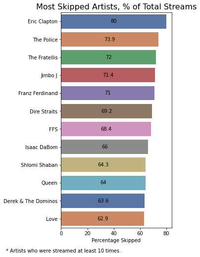

# My Spotify

## Introduction
In this project I analyze my personal spotify data, including my streaming history between 09/2020-09/2021 and my library items (a.k.a, songs I liked). These datasets were retrieved from my account section on Spotify's website. To complement them I also use public data I gathered from Spotify's API (for more info see [here](https://developer.spotify.com/documentation/web-api/)).

For the **full notebook** click [here](https://nbviewer.org/github/alonrashty/My-Spotify/blob/master/my_spotify.ipynb)

## Results

It seems like Editors started to dominate in February 21', continuing up until September, when Manic Street Preaches suddenly took the throne.

Most of the time I stream the playlist "Liked Songs", which contains the items in my library. Although I actively marked them as such, I don't want to listen to them __every__ time they come up. To explore that phenomenon, I use the `skipped` variable I created eralier. Let's start looking at the artists level:

It appears that most of these artists intersects with my most played artists, which is a bit strange. It happens because each of them has a different probability to come up when shuffling through my library. Let's adjust these values to consider this issue:

This is a completely different picture, but note that Franz Ferdinand (also FFS) appears in both figures. That means that while I have many of their songs marked as "liked", I tend to skip them too often. Maybe I should reconsider my affection to them...

The next thing to consider is openness to new music. This can be found by comparing streaming time of songs in my library to those that aren't there. Two major caveats arise:
    
  1. I can't distinguish songs that got into the library in the middle of the year.
  2. I occasionally listen to reading soundtracks for focusing. I might be able to distinguish them by getting the playlists, but currently I skip that.

Nevertheless, let's see what we have:

